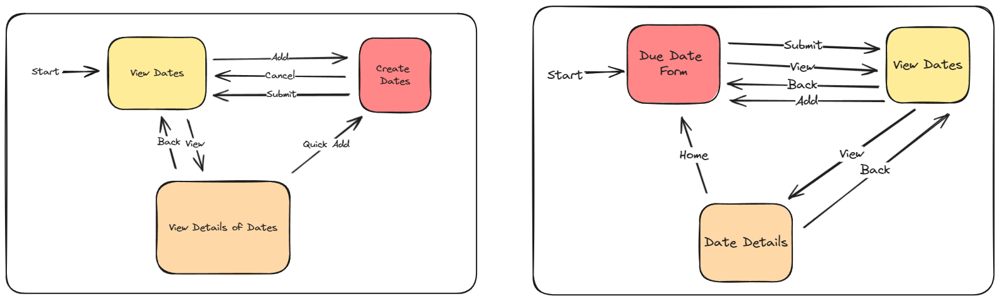
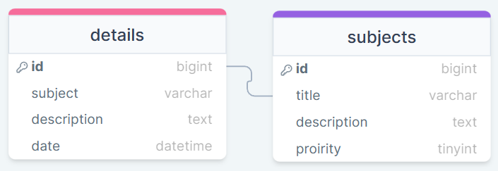
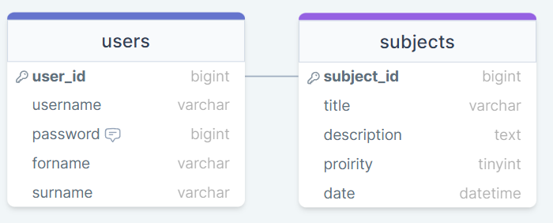
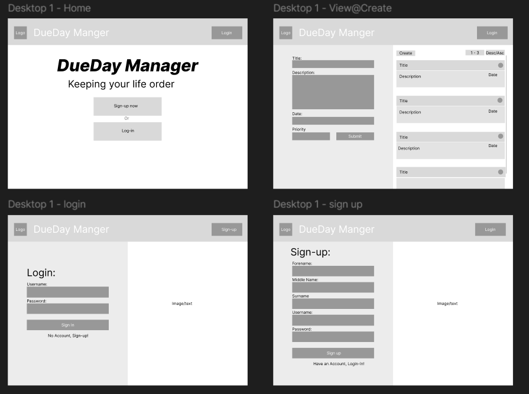

# Development of a Database-Driven Web Application for NCEA Level 3

Project Name: **DueDay Manager**

Project Author: **Phillip Bredenhann**

Assessment Standards: **91902** and **91903**

-------------------------------------------------

## Design, Development and Testing Log

### 17/05/2024

Today I have been working on the development and design of the possible layout of how the interface of the website will work.

I have created two possible layouts for how the users will use the websites interface. There are 2 possible layouts. The first layout operates as a typical website, where users load into the homepage first before taking any actions. The second layout is fast-paced, loading the users directly into the form rather than the homepage. Here is an example <a href ="https://quicknote.io/">QuickNote<a>.

I have also designed a layout for how the database will function and look.

 

As shown on the image, it will include  a primary key and foreign key. This will show how the information and data will be stored.

> After showing my client and explaining what information it will, or could hold. She suggested to have more data types/variables like forename, surname, username and etc to make it easier to identify the user and making the variables "clearer."

After having the conversation with the end-user I started working, researching what information will be needed and how to effectively arrange it, hopefully making it "Clearer."

### 24/05/2024

After reviewing my DataBase I decided to improve it with a better version.

Currently I have added a view more variables and named it appropriately. I added username, password, forename, surname and date to the table, while also organizing it.

> The end-user is happy from with the improvement version.

Ill also need to add a hash

### 07/06/2024

I started doing development on potential design of the website.

I tried recreating a slick, straight forward design that the users can easily interact with. 

> Replace this text with any user feedback / comments

Replace this text with notes describing how you acted upon the user feedback: made changes to design, etc.

### 08/06/2024

I designed how the website would look if it was switched into mobile view.

Replace this text with brief notes describing what you worked on, any decisions you made, any changes to designs, etc. Add screenshots / links to other media to illustrate your notes where necessary.

> Replace this text with any user feedback / comments

Replace this text with notes describing how you acted upon the user feedback: made changes to design, etc.

### DATE HERE

Replace this test with what you are working on

Replace this text with brief notes describing what you worked on, any decisions you made, any changes to designs, etc. Add screenshots / links to other media to illustrate your notes where necessary.

> Replace this text with any user feedback / comments

Replace this text with notes describing how you acted upon the user feedback: made changes to design, etc.

### DATE HERE

Replace this test with what you are working on

Replace this text with brief notes describing what you worked on, any decisions you made, any changes to designs, etc. Add screenshots / links to other media to illustrate your notes where necessary.

> Replace this text with any user feedback / comments

Replace this text with notes describing how you acted upon the user feedback: made changes to design, etc.
